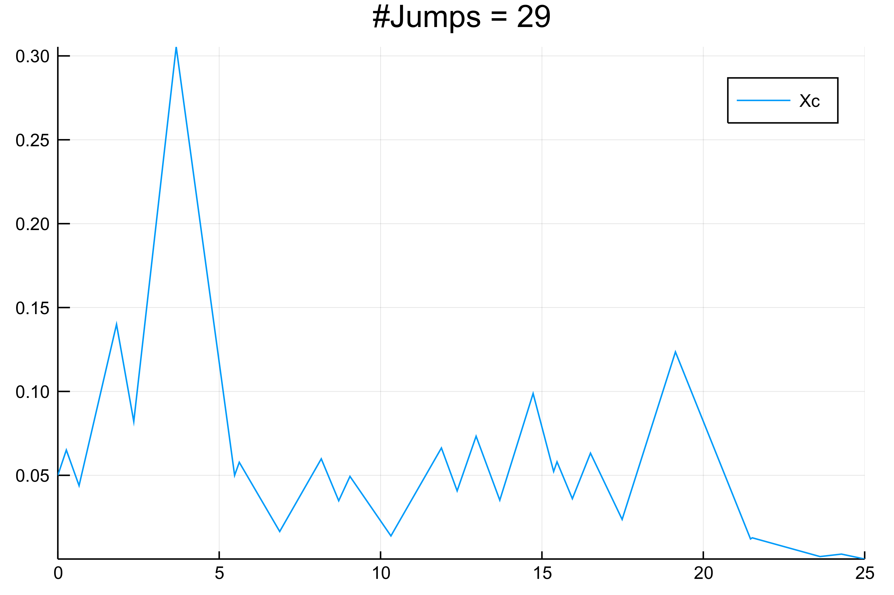
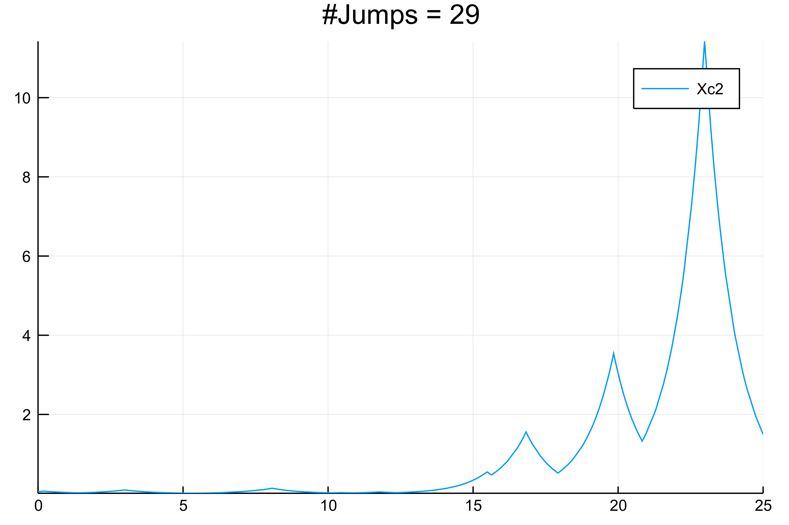

# PDMP.jl 

[](https://travis-ci.org/rveltz/PDMP.jl)
<a href='https://coveralls.io/github/rveltz/PDMP.jl?branch=master'></a>
<!--[](https://ci.appveyor.com/project/rveltz/pdmp-jl/branch/master)
--><!--[](https://rveltz.github.io/PDMP.jl/stable)-->
[](https://rveltz.github.io/PDMP.jl/latest)

This is a joint work of [Romain Veltz](https://romainveltz.pythonanywhere.com/) ([@rveltz](http://github.com/rveltz)) and [Simon Frost](http://www.vet.cam.ac.uk/directory/sdf22@cam.ac.uk) ([@sdwfrost](http://github.com/sdwfrost)).

PDMP.jl is a Julia package that allows simulation of *Piecewise Deterministic Markov Processes* (PDMP); these encompass hybrid systems and jump processes, comprised of continuous and discrete components, as well as processes with time-varying rates. The aim of the package is to provide methods for the simulation of these processes that are "exact" up to the ODE integrator.

<!--Please, read the [documentation](https://rveltz.github.io/PDMP.jl/latest) for more information.-->

We provide several methods for the simulation:

- a recent trick, called **CHV**, explained in [paper-2015](http://arxiv.org/abs/1504.06873) which allows to implement the **True Jump Method** without the need to use event detection schemes for the ODE integrator. These event detections can be quite unstable as explained in [paper-2015](http://arxiv.org/abs/1504.06873) and CHV provide a solution to this problem.
- **rejection methods** for which the user is asked to provide a bound on the reaction rates. These last methods are the most "exact" but not the fastest if the reaction rate bound is not tight. In case the flow is known analytically, a method is also provided.


These methods require solving stiff ODEs (for CHV ) in an efficient manner. [```Sundials.jl```](https://github.com/JuliaLang/Sundials.jl) and [```LSODA.jl```](https://github.com/rveltz/LSODA.jl) are used, but other solvers could be easily added. (See [stiff ode solvers](http://lh3lh3.users.sourceforge.net/solveode.shtml)).

We briefly recall facts about a simple class of PDMPs. They are described by a couple $(x_c,x_d)$ where $x_c$ is solution of the differential equation $\frac{dx_c}{dt} = F(x_c,x_d,t)$. The second component $x_d$ is a jump process with rates $R(x_c,x_d,t)$. At each jump of $x_d$, a jump can also be added to the continuous variable $x_c$.


## Installation

To install this (unregistered) package, run the command 

```julia
Pkg.clone("https://github.com/rveltz/PDMP.jl.git")
```

## Basic example with CHV method

**A strong requirement for the CHV method is that the total rate (*i.e.* sum(rate)) must be positive. This can be easily achieved by adding a dummy Poisson process with very low intensity (see next section).**

See also the [examples directory](https://github.com/rveltz/PDMP.jl/tree/master/examples) for more involved examples.

A simple example of a TCP process is given below. More precisely, we look at the following process of switching dynamics where X(t) = $(x_c(t), x_d(t)) \in\mathbb R\times\lbrace-1,1\rbrace$. In between jumps, $x_c$ evolves according to $\dot x_c(t) = x_d(t)x_c(t)$. 

We first need to load the library.

```julia
using PDMP
```
We then define a function that encodes the dynamics in between jumps. We need to provide the vector field of the ODE with a function. Hence, we need to define a function that given continuous state $x_c$ and discrete state $x_d$ at time $t$ return the vector field. In addition some parameters can be passed with the variable `parms`.

```julia
function F_tcp!(xcdot, xc, xd, t, parms)
  # vector field used for the continuous variable
  xcdot[1] = xd[1]*xc[1]
end
```

Let's consider a stochastic process with following transitions.

* x_d => x_d - 2, rate = 1 if x_d > 0
* x_d => x_d + 2, rate = 1 if x_d < 0
	
This is encoded in the following function


```julia
function R_tcp!(rate, xc, xd, t, parms, sum_rate::Bool)
  # transition rates function for each transition
  # in this case,  the transitions are xd->xd+2 or xd->xd-2
  # sum_rate is a boolean which tells R_tcp if it needs to return the total reaction rates, this may 
  # i.e. the sum of the rates or the vector of the rates
  if sum_rate == false
      if xd[1] > 0
          rate[1] = 0.
          rate[2] = 1.
      else
      	  rate[1] = 1.
          rate[2] = 0.
      end
      #we return 0. because nothing is supposed to be returned
      return 0.
  else
  	# we return sum(rate) without altering rate as we are asked to do
    return 1.
  end
end

# initial conditions for the continuous/discrete variables
xc0 = vec([0.05])
xd0 = vec([1])

# matrix of jumps for the discrete variables, analogous to chemical reactions
nu = reshape([[2];[-2]],2,1)


# parameters
parms = [0.]
tf = 25.

# compile the program:
dummy =  PDMP.pdmp!(xc0,xd0,F_tcp!,R_tcp!,nu,parms,0.0,tf,n_jumps=1)

# compute a trajectory, in this case 100 jumps
srand(123)
result =  @time PDMP.pdmp!(xc0,xd0,F_tcp!,R_tcp!,nu,parms,0.0,tf,n_jumps=100)

# plotting
using Plots
Plots.plot(result.time, result.xd[1,:],line=:step,title = string("#Jumps = ",length(result.time)),label="Xd")
Plots.plot(result.time, result.xc',title = string("#Jumps = ",length(result.time)),label="Xc")
```

This produces the following graph:



## Adding more sampling points in between jumps
The current interface "only" returns the jumping times. On may want to resolve the trajectory in between jumps. For example, in the previous example, in between two jumps, the trajectory should be exponential and not linear as shown. 

A simple trick to force output is to add a Poisson process to the reaction with a given sampling rate. We have to modify `nu, xcd0` and `R_tcp!` for this.

```julia
nu2 = [[2 0];[-2 0];[0 1]]
# the second component is the Poisson process
xd0 = vec([1, 0])

function R_tcp2!(rate, xc, xd, t, parms, sum_rate::Bool)
  # transition rates function for each transition
  # in this case,  the transitions are xd->xd+2 or xd->xd-2
  # sum_rate is a boolean which tells R_tcp if it needs to return the total reaction rates, this may 
  # i.e. the sum of the rates or the vector of the rates
  rate_save = 10. #sampling rate in between true jumps
  if sum_rate == false
      if xd[1] > 0
          rate[1] = 0.
          rate[2] = 1.
          rate[3] = rate_save #Poisson process used as sampling process
      else
          rate[1] = 1.
          rate[2] = 0.
          rate[3] = rate_save #Poisson process used as sampling process
      end
      #we return 0. because nothing is supposed to be returned
      return 0.
  else
    # we see that we effectively return sum(rate) without altering rate because it is not asked to do so
    return 1. + rate_save
  end
end

srand(123)
result2 =  @time PDMP.pdmp!(xc0,xd0,F_tcp!,R_tcp2!,nu2,parms,0.0,tf,n_jumps=10000)
Plots.plot(result2.time, result2.xc',title = string("#Jumps = ",length(result2.time)),label="Xc2")
```

This gives the following result:


 
## Basic example with the rejection method
The rejection method assume some a priori knowledge of the process one wants to simulation. In particular, the user must be able to provide a bound on the total rates. More precisely, the user must provide a constant bound in between jump. In the example above, this is easily done as returning `sum(rate), bound_rejection`. Note that this means that in between jumps,

`sum(rate)(t) <= bound_rejection `

```julia
nu2 = [[2 0];[-2 0];[0 1]]
# the second component is the Poisson process
xd0 = vec([1, 0])

function R_tcp2!(rate, xc, xd, t, parms, sum_rate::Bool)
  # transition rates function for each transition
  # in this case,  the transitions are xd->xd+2 or xd->xd-2
  # sum_rate is a boolean which tells R_tcp if it needs to return the total reaction rates, this may 
  # i.e. the sum of the rates or the vector of the rates
  rate_save       = 10.           # sampling rate in between true jumps
  bound_rejection = 1.+rate_save  # bound on the total rate, here 0 + 1 + rate_save
  if sum_rate == false
      if xd[1] > 0
          rate[1] = 0.
          rate[2] = 1.
          rate[3] = rate_save #Poisson process used as sampling process
      else
          rate[1] = 1.
          rate[2] = 0.
          rate[3] = rate_save #Poisson process used as sampling process
      end
      #we return 0. because nothing is supposed to be returned
      return 0., bound_rejection
  else
    # we see that we effectively return sum(rate) without altering rate because it is not asked to do so
    return 1. + rate_save, bound_rejection
  end
end
```

We can now simulate this process as follows

```julia
srand(123)
result3 =  @time PDMP.pdmp!(xc0,xd0,F_tcp!,R_tcp2!,nu2,parms,0.0,tf,n_jumps=10000,algo=:rejection)
Plots.plot(result3.time, result3.xc',title = string("#Jumps = ",length(result3.time)),label="rejection")
```


# Application programming interface

## Functions

```@docs
pdmp!
```


```@docs
chv!
```


```@docs
rejection_exact
```
